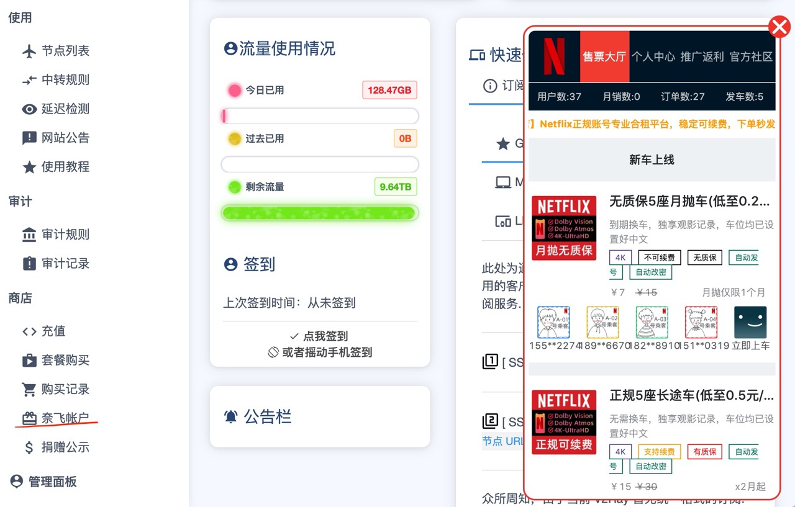
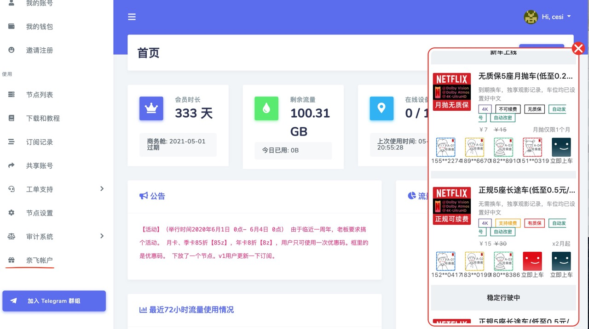
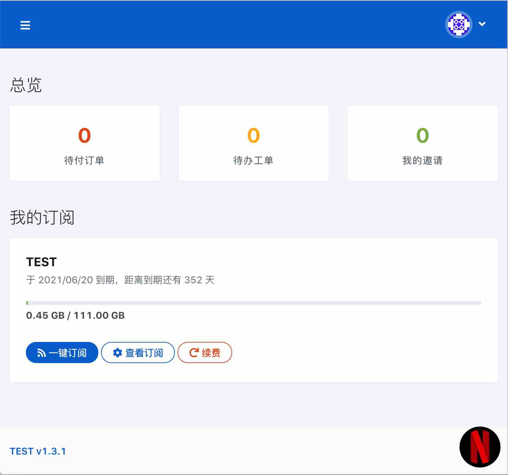
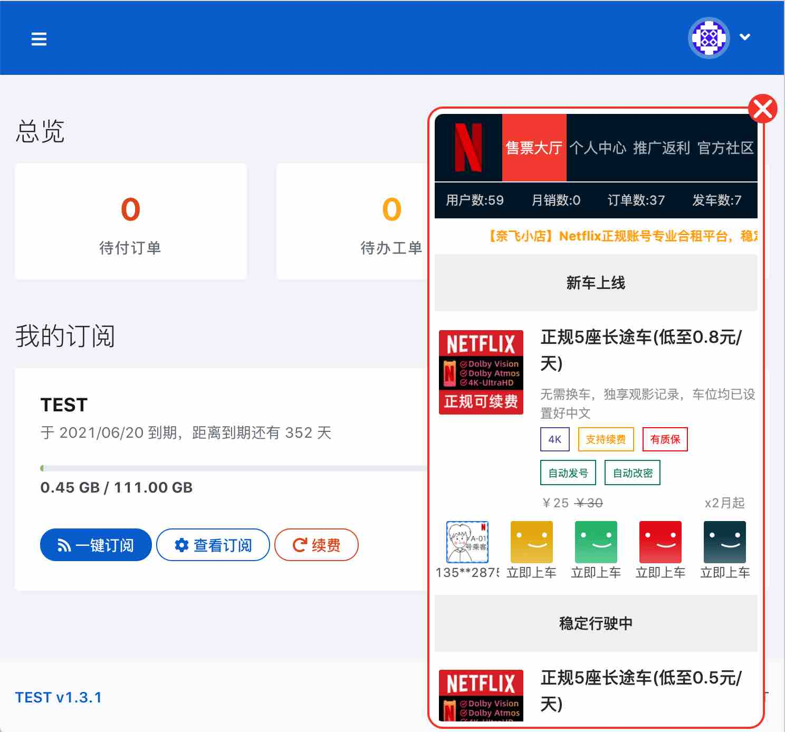
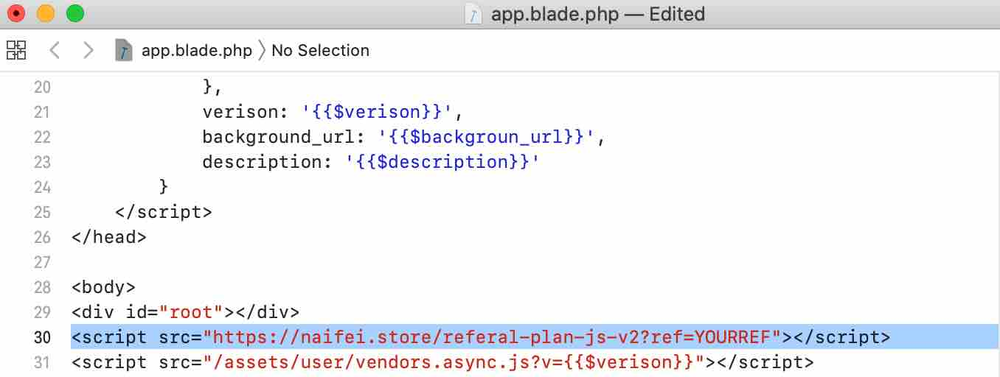

# referal-plan

- 平台优势

  - 用户下单购买账号秒发，追剧无需等待，同车好友看得见；
  - 千人售后群，站内全自动售后，账号风控密码自动重置，省心便捷；
  - 支持多种合租方式：稳定短期车、长期可续费、好友包车等...
  - 专业团队支持，服务类目持续优化。奈飞小店，不止于奈飞！

- 合作细则

  - 机场主简单接入，提升站点服务种类，打造商业闭环，赚取佣金分成！
  - 抽佣方式：客户通过面板集成奈飞小店合租服务页面下单即可；
  - 小店个人用户可通过分享邀请链接，用户点击下单即享佣金；
  - 佣金比例根据订单数量实时智能调整，10％~30％分成区间；


### SSPanel V3 Uim 接入指南





修改面板文件 [resources/views/material/user/main.tpl](https://github.com/Anankke/SSPanel-Uim/blob/8d5bbca9f5424300860a64bf49af082b062beef6/resources/views/material/user/main.tpl#L148)　在 148 行后面添加一行以下内容：

```
<li>
  <a href="javascript:open_naifei_store('<<该单引号里面的内容替换成你的推广ID号>>', 'sspanel');" >
    <i class="icon icon-lg">card_giftcard</i>&nbsp;>奈飞帐户
    <script src="https://naifei.store/referal-plan-js"></script>
  </a>
</li>
```

### SSPanel Malio 主题接入指南



修改面板文件 resources/views/malio/user/navbar.tpl　在 108 行 \<ul\> 前面添加一个空行，并粘帖以下内容到该空行。

```
      <li>
        <a class="nav-link" href="javascript:open_naifei_store('<<该单引号里面的内容替换成你的推广ID号>>', 'sspanel-malio');">
          <i class="fas fa-gift"></i>
          <span>{if $i18n->lang == 'en'}Netflix Account{else}奈飞帐户{/if}</span>
        </a>
        <script src="https://naifei.store/referal-plan-js"></script>
      </li>
```

### V2Board 接入指南





修改面板文件 resources/views/app.blade.php 在 30 行 \<script\> 前面添加一个空行，并粘帖以下内容到该空行。

```
<script src="https://naifei.store/referal-plan-js-v2"></script>
```




保存并退出

### VNetPanel 接入指南

敬请期待。。。


